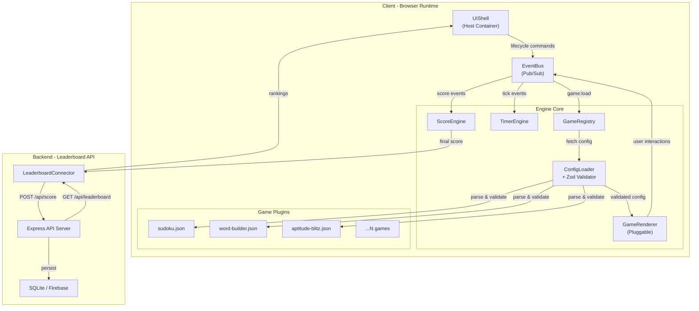
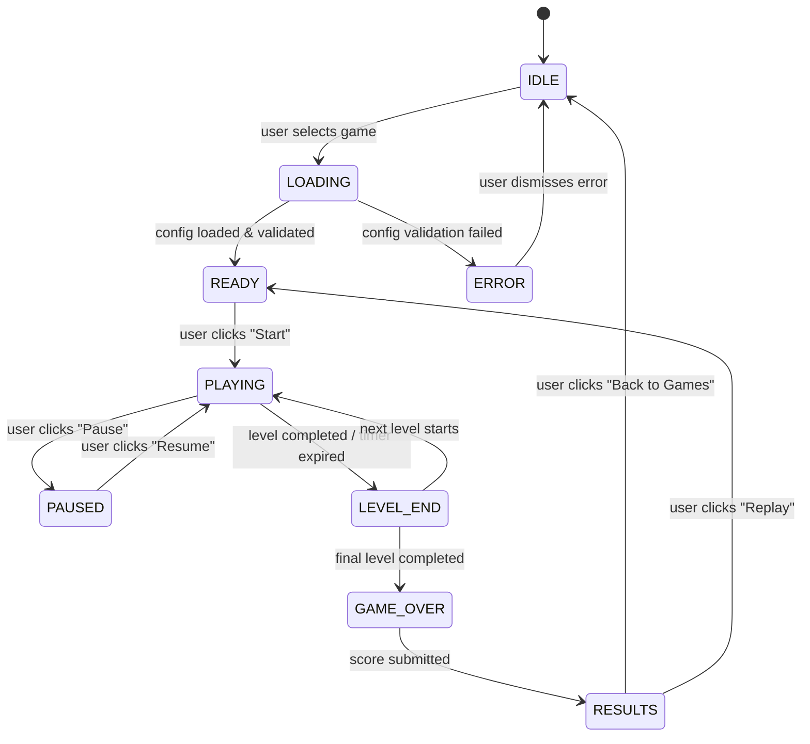

# DELIVERABLE 1: ENGINE ARCHITECTURE DOCUMENT

## TaPTaP Game Engine - System Architecture Specification

**Version:** 1.0.0  
**Date:** March 7, 2026  
**Status:** Blueprint - Checkpoint 1  
**Classification:** Engine League (League 1)

---

## Index

| # | Section | Subsections |
|---|---------|-------------|
| 1 | [Vision & Design Philosophy](#1-vision--design-philosophy) | 1.1 Problem Statement, 1.2 Why Plugin-Based Architecture, 1.3 Design Principles |
| 2 | [System Architecture Overview](#2-system-architecture-overview) | 2.1 High-Level Architecture Diagram, 2.2 Data Flow, 2.3 Layer Responsibilities |
| 3 | [Component Breakdown](#3-component-breakdown) | 3a. GameRegistry, 3b. ConfigLoader, 3c. GameRenderer, 3d. TimerEngine, 3e. ScoreEngine, 3f. LeaderboardConnector, 3g. UIShell, 3h. EventBus |
| 4 | [JSON-Driven Plugin Architecture](#4-json-driven-plugin-architecture) | 4.1 How a New Game is Added, 4.2 The Game Contract, 4.3 Config Validation Pipeline, 4.4 Zero-Code Registration Example |
| 5 | [Tech Stack & Rationale](#5-tech-stack--rationale) | 5.1 Technology Decisions |
| 6 | [Scalability & Extensibility Analysis](#6-scalability--extensibility-analysis) | 6.1 Scaling to 50+ Games, 6.2 Concurrent Leaderboard Players, 6.3 TaPTaP Backend Integration, 6.4 Known Limitations & v2 Mitigations |
| 7 | [Folder Structure](#7-folder-structure) | Full annotated directory tree |
| 8 | [Game Lifecycle State Machine](#8-game-lifecycle-state-machine) | 8.1 State Diagram, 8.2 State Descriptions, 8.3 State Transition Guards |
| 9 | [Leaderboard Design](#9-leaderboard-design) | 9.1 API Endpoint Design, 9.2 Database Schema, 9.3 Tie-Breaking Algorithm, 9.4 Anti-Cheat Considerations |
| 10 | [Future Roadmap (v2)](#10-future-roadmap-v2) | 10.1 Multiplayer, 10.2 Analytics, 10.3 Admin Dashboard, 10.4 AI Content, 10.5 Timeline |

---

## 1. Vision & Design Philosophy

### 1.1 Problem Statement

TaPTaP serves 6+ lakh students across India with assessments, leaderboards, and skill-based engagement. The platform now requires a **weekly rotation of interactive learning games** - Sudoku, Word Builder, Aptitude Blitz, Logic Grids, and an ever-growing catalogue.

Building each game as a standalone application creates unsustainable technical debt: duplicated scoring logic, inconsistent leaderboards, per-game deployment pipelines, and N×(developer-hours) scaling cost. The problem is not "build a game." The problem is **build a system that can produce an unlimited number of games from configuration alone**.

### 1.2 Why Plugin-Based, JSON-Driven Architecture

The engine adopts a **content-as-configuration** model inspired by how modern game engines (Unity, Godot) separate runtime from asset definitions:

| Concern | Traditional Approach | TaPTaP Engine Approach |
|---------|---------------------|----------------------|
| Adding a game | Write new app, new scoring, new API | Drop a JSON config file |
| Scoring logic | Per-game implementation | Centralized ScoreEngine with config-driven formulas |
| Leaderboard | Per-game API integration | Single LeaderboardConnector shared by all games |
| Deployment | Per-game CI/CD | One engine deployed; games are data |
| QA & Testing | Per-game test suites | Engine tests + schema validation |

**The engine is the constant. Games are the variables.**

### 1.3 Design Principles

1. **Separation of Concerns** - Engine runtime code never contains game-specific logic. Game behavior is expressed entirely through JSON configuration and optional renderer plugins.

2. **Zero-Config Game Addition** - A new game is added by authoring a JSON file that conforms to the `GameConfig` contract and placing it in the `/games` registry. No engine recompilation, no new routes, no code changes.

3. **Fail-Safe Configuration** - Every JSON config is validated against a Zod schema at load time. Malformed configs are rejected with structured, actionable error diagnostics before any rendering occurs.

4. **Deterministic Lifecycle** - Every game follows an identical state machine: `IDLE → LOADING → READY → PLAYING → PAUSED → LEVEL_END → GAME_OVER → RESULTS`. The engine enforces this lifecycle; games cannot invent ad-hoc states.

5. **Observable Architecture** - All module communication flows through an EventBus. Modules are loosely coupled; any module can be replaced, extended, or instrumented without cascading changes.

---

## 2. System Architecture Overview

### 2.1 High-Level Architecture Diagram



### 2.2 Data Flow

```
JSON Config File
    │
    ▼
ConfigLoader (fetch + Zod validation)
    │
    ▼
GameRegistry (register, discover, instantiate)
    │
    ▼
GameRenderer (dynamic component resolution → render game UI)
    │
    ▼
User Interaction (clicks, drags, inputs)
    │
    ▼
EventBus dispatches → TimerEngine (tick/countdown) + ScoreEngine (calculate)
    │
    ▼
ScoreEngine computes final score
    │
    ▼
LeaderboardConnector (POST to API, GET rankings)
    │
    ▼
UIShell displays Results + Leaderboard
```

### 2.3 Layer Responsibilities

| Layer | Responsibility | Mutability |
|-------|---------------|------------|
| **UIShell** | Chrome, navigation, lifecycle controls | Stable - changes only for UX improvements |
| **Engine Core** | Game-agnostic runtime logic | Stable - no changes when adding games |
| **Game Plugins** | Game-specific config + optional custom renderers | Grows - new JSON files for each game |
| **Backend API** | Score persistence, leaderboard queries | Stable - schema-driven, game ID indexed |

---

## 3. Component Breakdown

### 3a. GameRegistry

**Responsibility:**  
Central catalogue of all available games. On engine boot, it scans the `/games` directory (or a remote manifest), registers each valid config, and exposes a queryable interface to the UIShell for game selection.

**Interface:**
```typescript
interface IGameRegistry {
  register(config: GameConfig): void;
  getGame(gameId: string): GameConfig | null;
  listGames(filter?: { category?: GameCategory; difficulty?: Difficulty }): GameConfig[];
  hasGame(gameId: string): boolean;
  getRendererForType(gameType: GameType): React.ComponentType<GameRendererProps>;
}
```

**Extensibility Points:**
- New games are auto-discovered by placing a JSON file in `/games/{game-name}/config.json`.
- Custom renderers are registered via a `rendererMap` that maps `GameType` enum values to React components. If no custom renderer is registered, the engine falls back to a built-in generic renderer.
- The registry emits `game:registered` and `game:unregistered` events on the EventBus.

---

### 3b. ConfigLoader

**Responsibility:**  
Fetches game configuration files (local or remote), validates them against the Zod master schema, and returns strongly-typed `GameConfig` objects. Malformed configs are rejected before they reach any renderer.

**Interface:**
```typescript
interface IConfigLoader {
  load(source: string | URL): Promise<GameConfig>;
  validate(raw: unknown): ValidationResult<GameConfig>;
  preload(gameIds: string[]): Promise<Map<string, GameConfig>>;
}

type ValidationResult<T> = 
  | { success: true; data: T }
  | { success: false; errors: ConfigError[] };

type ConfigError = {
  path: string;       // e.g., "scoringConfig.basePoints"
  code: string;       // e.g., "INVALID_RANGE"
  message: string;    // e.g., "basePoints must be between 1 and 10000"
  received: unknown;
};
```

**Extensibility Points:**
- Supports both local file imports and remote URL fetching (for TaPTaP backend integration).
- Schema versions are tracked in config metadata; the loader can handle migrations.
- Validation schemas are composable - game-type-specific schemas extend the master schema.

---

### 3c. GameRenderer

**Responsibility:**  
Dynamically resolves the correct rendering component for a given `GameType` and renders the game UI from the validated config. Supports grid-based, word-based, drag-drop, and MCQ layouts.

**Interface:**
```typescript
interface GameRendererProps {
  config: GameConfig;
  level: number;
  onAction: (action: GameAction) => void;  // user interactions
  onComplete: (result: LevelResult) => void;
  isPaused: boolean;
}

// The renderer registry
type RendererMap = Record<GameType, React.ComponentType<GameRendererProps>>;
```

**Built-In Renderer Types:**

| GameType | Renderer | Description |
|----------|----------|-------------|
| `GRID` | `GridRenderer` | NxN cell grid with pre-filled constraints (Sudoku, Logic Grid) |
| `WORD` | `WordRenderer` | Letter tiles, word banks, input fields (Word Builder) |
| `MCQ` | `MCQRenderer` | Question + options with timer (Aptitude Blitz) |
| `DRAG_DROP` | `DragDropRenderer` | Draggable elements into target zones |
| `CUSTOM` | developer-provided | Escape hatch for novel game types |

**Extensibility Points:**
- Developers register new renderers via `GameRegistry.registerRenderer(gameType, Component)`.
- Renderers receive the full `GameConfig` and have no dependency on engine internals beyond the `GameRendererProps` contract.
- The `CUSTOM` type allows any React component as a renderer, enabling unlimited game types.

---

### 3d. TimerEngine

**Responsibility:**  
Manages time-related game mechanics: countdowns, count-up timers, per-level duration limits, progressive difficulty (decreasing time per level), and warning thresholds.

**Interface:**
```typescript
interface ITimerEngine {
  start(config: TimerConfig): void;
  pause(): void;
  resume(): void;
  reset(): void;
  getElapsed(): number;    // milliseconds
  getRemaining(): number;  // milliseconds (countdown mode)
  onTick(callback: (tick: TimerTick) => void): Unsubscribe;
  onWarning(callback: (warning: TimerWarning) => void): Unsubscribe;
  onExpire(callback: () => void): Unsubscribe;
}

type TimerTick = {
  elapsed: number;
  remaining: number;
  isWarning: boolean;
};
```

**Behavior:**
- In `countdown` mode: ticks down from `duration` to 0; emits `timer:warning` at configured thresholds (e.g., 30s, 10s, 5s); emits `timer:expired` at 0.
- In `countup` mode: ticks upward; no expiry; used for time-tracked scoring.
- Publishes all events to EventBus so ScoreEngine and UIShell can react independently.
- Precision: uses `requestAnimationFrame` for rendering updates, `performance.now()` for elapsed calculation (not `setInterval` which drifts).

---

### 3e. ScoreEngine

**Responsibility:**  
Computes scores based on the game config's `scoringConfig`. Handles base points, time bonuses, hint penalties, multipliers, streak bonuses, and final score aggregation across levels.

**Interface:**
```typescript
interface IScoreEngine {
  initialize(config: ScoringConfig): void;
  recordAction(action: ScoredAction): void;
  applyHintPenalty(): void;
  calculateLevelScore(timeTaken: number): LevelScore;
  calculateFinalScore(): FinalScore;
  getState(): ScoreState;
}

type LevelScore = {
  baseScore: number;
  timeBonus: number;
  hintPenalty: number;
  multiplier: number;
  levelTotal: number;
};

type FinalScore = {
  levelScores: LevelScore[];
  totalScore: number;
  timeTaken: number;    // total milliseconds
  accuracy: number;     // 0–1
};
```

**Scoring Formula:**
```
levelTotal = (basePoints × correctActions × multiplier) + timeBonus − (hintPenalty × hintsUsed)

timeBonus = max(0, floor(remainingSeconds × timeBonusMultiplier))

finalScore = Σ levelTotals
```

**Extensibility Points:**
- `scoringConfig` in the JSON allows per-game custom formulas.
- The `timeBonusFormula` field accepts preset identifiers (`linear`, `exponential`, `none`) enabling varied time pressure across game types.
- Negative marking (for MCQ games) is handled via `penaltyPerWrong` in config.

---

### 3f. LeaderboardConnector

**Responsibility:**  
Interfaces between the client engine and the backend leaderboard API. Submits scores, fetches rankings, handles optimistic UI updates, and manages network resilience.

**Interface:**
```typescript
interface ILeaderboardConnector {
  submitScore(submission: ScoreSubmission): Promise<SubmissionResult>;
  getLeaderboard(gameId: string, options?: LeaderboardQuery): Promise<LeaderboardEntry[]>;
  getUserRank(gameId: string, userId: string): Promise<UserRank>;
}

type ScoreSubmission = {
  userId: string;
  gameId: string;
  score: number;
  timeTaken: number;     // milliseconds
  level: number;
  metadata: Record<string, unknown>;
};

type LeaderboardEntry = {
  rank: number;
  userId: string;
  displayName: string;
  score: number;
  timeTaken: number;
  submittedAt: string;   // ISO 8601
};
```

**Behavior:**
- **Optimistic Updates:** On score submission, the connector immediately inserts the score into the local leaderboard view (sorted correctly) before the API response arrives. On API failure, the entry is marked as "pending sync."
- **Retry Logic:** Failed submissions are queued in `localStorage` and retried on next session.
- **Tie-Breaking:** Primary sort: descending score. Secondary sort: ascending timeTaken. Tertiary sort: ascending submittedAt (first to achieve the score ranks higher).

---

### 3g. UIShell

**Responsibility:**  
The host container that wraps all game instances. Manages the application chrome (header, navigation, game selector), mounts game renderers, and controls the game lifecycle via user-facing controls (start, pause, quit, replay).

**Interface:**
```typescript
interface IUIShell {
  mountGame(gameId: string): void;
  unmountGame(): void;
  transitionTo(state: GameState): void;
  showResults(score: FinalScore, leaderboard: LeaderboardEntry[]): void;
  showError(error: EngineError): void;
}
```

**Lifecycle Management:**

| User Action | UIShell Response |
|-------------|-----------------|
| Select game | `mountGame(gameId)` → transitions to `LOADING` |
| Game loaded | Transitions to `READY`, shows "Start" CTA |
| Press Start | Transitions to `PLAYING`, starts TimerEngine |
| Press Pause | Transitions to `PAUSED`, pauses TimerEngine |
| Press Resume | Transitions to `PLAYING`, resumes TimerEngine |
| Complete level | Transitions to `LEVEL_END`, shows level summary |
| All levels done | Transitions to `GAME_OVER`, submits score |
| Score submitted | Transitions to `RESULTS`, shows score + leaderboard |
| Press Replay | Resets state, transitions to `READY` |

---

### 3h. EventBus

**Responsibility:**  
Internal publish/subscribe system enabling decoupled communication between all engine modules. No module directly calls another module's methods; all cross-module communication flows through typed events.

**Interface:**
```typescript
interface IEventBus {
  emit<T extends EventType>(type: T, payload: EventPayload[T]): void;
  on<T extends EventType>(type: T, handler: (payload: EventPayload[T]) => void): Unsubscribe;
  once<T extends EventType>(type: T, handler: (payload: EventPayload[T]) => void): Unsubscribe;
  off<T extends EventType>(type: T, handler: (payload: EventPayload[T]) => void): void;
}

// Typed event catalogue
type EventPayload = {
  'game:load':       { gameId: string };
  'game:ready':      { config: GameConfig };
  'game:start':      { level: number };
  'game:pause':      {};
  'game:resume':     {};
  'game:action':     { action: GameAction };
  'game:levelEnd':   { levelResult: LevelResult };
  'game:over':       { finalScore: FinalScore };
  'timer:tick':      { elapsed: number; remaining: number };
  'timer:warning':   { remaining: number };
  'timer:expired':   {};
  'score:updated':   { currentScore: number };
  'leaderboard:loaded': { entries: LeaderboardEntry[] };
  'error:config':    { errors: ConfigError[] };
  'error:runtime':   { message: string; stack?: string };
};
```

**Why EventBus:**
- **Testability:** Each module can be unit-tested by mocking the EventBus.
- **Extensibility:** New modules (analytics, telemetry, achievement system) subscribe to existing events without modifying producers.
- **Debuggability:** An `EventLogger` middleware can log all events for debugging.

---

## 4. JSON-Driven Plugin Architecture

### 4.1 How a New Game is Added

```
Developer wants to add "Logic Grid" game:

Step 1: Create /games/logic-grid/config.json conforming to GameConfig schema
Step 2: (Optional) Create /games/logic-grid/LogicGridRenderer.tsx for custom rendering
Step 3: (Optional) Register custom renderer in /games/logic-grid/index.ts
Step 4: Done. Engine auto-discovers the config on next load.

No engine core code is modified. Zero. None.
```

### 4.2 The Game Contract

Every game config JSON must provide:

| Field | Type | Required | Purpose |
|-------|------|----------|---------|
| `gameId` | `string` | ✅ | Unique identifier |
| `gameType` | `GameType` enum | ✅ | Determines which renderer to use |
| `title` | `string` | ✅ | Display name |
| `description` | `string` | ✅ | Game description |
| `version` | `string` | ✅ | Semantic version of this config |
| `difficulty` | `Difficulty` | ✅ | Overall difficulty bracket |
| `levels` | `LevelConfig[]` | ✅ | Per-level game data |
| `timerConfig` | `TimerConfig` | ✅ | Timer behavior |
| `scoringConfig` | `ScoringConfig` | ✅ | Score calculation rules |
| `uiConfig` | `UIConfig` | ❌ | Theme overrides |
| `metadata` | `Metadata` | ❌ | Author, tags, target skills |
| `apiConfig` | `APIConfig` | ❌ | Custom API endpoints |

### 4.3 Config Validation Pipeline

```
Raw JSON
  │
  ├─── Step 1: JSON.parse() - catches syntax errors
  │
  ├─── Step 2: Zod masterSchema.safeParse() - structural validation
  │     │
  │     ├── Missing required fields → reject with field paths
  │     ├── Invalid enum values → reject with allowed values
  │     ├── Out-of-range numbers → reject with valid range
  │     └── Type mismatches → reject with expected vs received
  │
  ├─── Step 3: Game-type-specific validation
  │     │
  │     ├── GRID: validates grid dimensions, pre-filled cells fall within bounds
  │     ├── WORD: validates word bank is non-empty, no duplicate words
  │     ├── MCQ: validates each question has ≥2 options, exactly 1 correct answer
  │     └── DRAG_DROP: validates source/target zone counts
  │
  └─── Step 4: Semantic validation
        │
        ├── Level count ≥ 1
        ├── Timer duration > 0 for countdown mode
        ├── Scoring basePoints > 0
        └── gameId is unique in registry
```

### 4.4 Zero-Code Registration Example

**Scenario:** Adding "Pattern Match" - a game where players identify repeating visual patterns.

**Step 1:** Create config file at `/games/pattern-match/config.json`:
```json
{
  "gameId": "pattern-match-v1",
  "gameType": "GRID",
  "title": "Pattern Match",
  "description": "Identify the repeating pattern in the grid",
  "version": "1.0.0",
  "difficulty": "medium",
  "levels": [
    {
      "levelNumber": 1,
      "gridSize": 4,
      "data": { "pattern": [1,2,3,1,2,3,1,2], "hidden": [5,7] },
      "timeLimit": 60
    }
  ],
  "timerConfig": { "type": "countdown", "duration": 60, "warningAt": [15, 5] },
  "scoringConfig": { "basePoints": 100, "timeBonusMultiplier": 2, "penaltyPerHint": 25 }
}
```

**Step 2:** The engine's `GameRegistry` auto-discovers this file.

**Step 3:** Since `gameType` is `GRID`, the `GridRenderer` handles rendering automatically.

**Result:** The game appears in the game selector, is playable, timed, scored, and leaderboard-ready. **Zero engine code was changed.**

---

## 5. Tech Stack & Rationale

### 5.1 Technology Decisions

| Layer | Technology | Justification |
|-------|-----------|---------------|
| **UI Framework** | **React 18** | Component-based architecture maps directly to the plugin model. Each game renderer is a React component. React's reconciliation handles dynamic component swapping (game loading/unloading) efficiently. The ecosystem provides mature tooling for testing (React Testing Library) and state management. Alternative (Vue, Svelte) considered; React chosen for its larger hiring pool and TaPTaP team familiarity. |
| **Language** | **TypeScript 5** | The entire engine is a contract-enforcement system - JSON configs must conform to typed schemas, modules must satisfy typed interfaces. TypeScript's structural type system enables compile-time guarantees that the Zod runtime validation complements. Without TypeScript, config validation errors would surface only at runtime. Alternative (plain JS + JSDoc) rejected for insufficient type safety at module boundaries. |
| **Styling** | **TailwindCSS 3** | Utility-first CSS ensures consistent spacing, typography, and color across all game UIs. The UIShell and shared components use a constrained design token system. TailwindCSS compiles to minimal CSS (purges unused utilities), Critical for mobile performance across low-end devices common in TaPTaP's student demographic. Alternative (CSS Modules, styled-components) rejected for slower development velocity. |
| **State Management** | **Zustand** | Lightweight (1.1KB), un-opinionated store for game session state. The engine needs to track: current game, current level, score, timer, lifecycle state. Zustand's selector-based subscriptions prevent unnecessary re-renders. Alternative (Redux) rejected - excessive boilerplate for this scope. Alternative (Context API) rejected - causes full sub-tree re-renders on state changes, problematic for 60fps timer updates. |
| **Schema Validation** | **Zod** | Runtime schema validation is critical - JSON configs arrive from files or APIs and must be validated before use. Zod provides TypeScript-first schemas with automatic type inference (`z.infer<typeof schema>` generates the TypeScript type), eliminating schema/type divergence. Custom error messages per field enable developer-friendly validation diagnostics. Alternative (Joi, Yup) rejected - Zod has tighter TypeScript integration and smaller bundle size. |
| **Build Tool** | **Vite 5** | Sub-second HMR during development. ESBuild-based transpilation is 10-100x faster than Webpack. Native ESM support eliminates bundling overhead during dev. For production, Rollup-based bundling produces optimized chunks. Alternative (Webpack 5) rejected - slower DX. Alternative (Turbopack) rejected - still in beta. |
| **Backend** | **Express + SQLite** | Minimalist leaderboard API. Express provides just enough routing and middleware for the 2-3 endpoints required. SQLite is zero-config (no database server), portable (single file), and handles the read/write load of a leaderboard comfortably up to ~100K concurrent users with WAL mode. For production scale beyond that, migration path to PostgreSQL is straightforward. Alternative (Firebase) considered for real-time - deferred to v2 multiplayer. |
| **Deployment** | **Vercel (frontend) + Render (backend)** | Vercel provides zero-config React deployment with global CDN, preview deployments per PR, and automatic HTTPS. Render provides free-tier Node.js hosting with persistent disk for SQLite. Alternative (Netlify) equivalent for frontend; Vercel chosen for faster builds. Alternative (Railway) equivalent for backend; Render chosen for free tier availability. |

---

## 6. Scalability & Extensibility Analysis

### 6.1 Scaling to 50+ Games Without Code Bloat

**Architecture Guarantee:** Adding game N+1 requires:
- 1 new JSON config file (~2-10KB)
- 0 engine core changes
- Optionally 1 new renderer component (only if the game type is genuinely novel)

At 50 games, the engine codebase remains identical. The `/games` directory grows, but each game is self-contained. Build tooling uses dynamic imports (`React.lazy()`) so only the active game's renderer is loaded - not all 50.

**Bundle Impact at Scale:**
- Engine core: ~80KB gzipped (constant)
- Per-game renderer: ~5-15KB gzipped (lazy loaded)
- Per-game config: ~2-10KB (fetched on demand)
- Total initial load: ~80KB regardless of game count

### 6.2 Concurrent Leaderboard Players

**Read Path:**
- Leaderboard queries are cached in-memory with a 30-second TTL.
- SQLite handles 10K+ concurrent reads with WAL mode.
- For >100K concurrent users, the migration path is: SQLite → PostgreSQL + Redis cache.

**Write Path:**
- Score submissions are idempotent (userId + gameId + timestamp).
- Duplicate detection prevents score inflation.
- Write throughput: SQLite WAL handles ~1000 writes/second - sufficient for the initial user base.

### 6.3 TaPTaP Backend Integration Architecture

```
┌──────────────────────────────────────────────────────┐
│                  TaPTaP Platform                      │
│  ┌─────────────┐  ┌──────────────┐  ┌──────────────┐│
│  │ Auth Service │  │Content CMS   │  │Analytics     ││
│  │(JWT tokens)  │  │(game configs)│  │(play data)   ││
│  └──────┬──────┘  └──────┬───────┘  └──────┬───────┘│
│         │                │                  │         │
│  ┌──────▼──────────────▼──────────────────▼───────┐ │
│  │           TaPTaP API Gateway                    │ │
│  └─────────────────────┬──────────────────────────┘ │
└────────────────────────┼────────────────────────────┘
                         │
              ┌──────────▼──────────┐
              │  TaPTaP Game Engine  │
              │  (this system)       │
              │                      │
              │ ConfigLoader fetches  │
              │ from CMS API instead  │
              │ of local files        │
              │                      │
              │ LeaderboardConnector  │
              │ posts to TaPTaP API   │
              │ instead of local API  │
              └──────────────────────┘
```

The engine's `apiConfig` in each game JSON already supports configurable endpoints, making the integration a config change, not a code change.

### 6.4 Known Limitations & v2 Mitigations

| Limitation | Impact | v2 Mitigation |
|-----------|--------|---------------|
| Client-side score calculation | Susceptible to manipulation | Server-side game state replay & validation |
| SQLite single-file database | Write contention at extreme scale | PostgreSQL with connection pooling |
| No real-time leaderboard | Stale data (30s cache) | WebSocket subscriptions for live updates |
| No user authentication | Anonymous scores possible | JWT integration with TaPTaP auth |
| No offline support | Requires connectivity | Service worker + IndexedDB score queue |
| Single language (English) | Limits reach | i18n config layer in game JSON |

---

## 7. Folder Structure

```
/taptap-engine
├── /src
│   ├── /core                          # Engine runtime - NEVER game-specific
│   │   ├── GameRegistry.ts            # Game catalogue, discovery, renderer mapping
│   │   ├── ConfigLoader.ts            # JSON fetch, parse, Zod validation pipeline
│   │   ├── ScoreEngine.ts             # Score calculation, formulas, aggregation
│   │   ├── TimerEngine.ts             # Countdown/countup, warnings, precision timing
│   │   ├── EventBus.ts                # Typed pub/sub for inter-module communication
│   │   ├── GameStateMachine.ts        # Lifecycle state transitions & guards
│   │   └── types.ts                   # Shared TypeScript interfaces & enums
│   │
│   ├── /renderers                     # Built-in game renderers (one per game type)
│   │   ├── GridRenderer.tsx           # NxN grid games (Sudoku, Logic Grid, Pattern)
│   │   ├── WordRenderer.tsx           # Word/letter games (Word Builder, Anagram)
│   │   ├── MCQRenderer.tsx            # Timed MCQ (Aptitude Blitz, Quiz)
│   │   ├── DragDropRenderer.tsx       # Drag-and-drop interaction games
│   │   └── RendererFactory.tsx        # Resolves gameType → renderer component
│   │
│   ├── /ui                            # UIShell - chrome, layout, shared components
│   │   ├── Shell.tsx                  # Root layout: header, game area, footer
│   │   ├── GameSelector.tsx           # Grid of available games from registry
│   │   ├── GameContainer.tsx          # Mounts active renderer, lifecycle controls
│   │   ├── TimerDisplay.tsx           # Visual timer with warning states
│   │   ├── ScoreDisplay.tsx           # Running score, multiplier indicators
│   │   ├── LeaderboardView.tsx        # Ranked score table with pagination
│   │   ├── ResultsScreen.tsx          # Post-game summary, score breakdown
│   │   ├── LevelTransition.tsx        # Between-level animation & summary
│   │   ├── ErrorBoundary.tsx          # Graceful error display for config/runtime errors
│   │   └── /shared                    # Reusable atoms (buttons, modals, toasts)
│   │       ├── Button.tsx
│   │       ├── Modal.tsx
│   │       ├── Toast.tsx
│   │       └── ProgressBar.tsx
│   │
│   ├── /store                         # Zustand state management
│   │   ├── gameStore.ts               # Current game session state
│   │   ├── leaderboardStore.ts        # Cached leaderboard data
│   │   └── uiStore.ts                 # UI state (modals, notifications)
│   │
│   ├── /hooks                         # Custom React hooks
│   │   ├── useGameLifecycle.ts        # Encapsulates lifecycle state transitions
│   │   ├── useTimer.ts                # React binding for TimerEngine
│   │   ├── useScore.ts                # React binding for ScoreEngine
│   │   └── useLeaderboard.ts          # Fetch & cache leaderboard data
│   │
│   ├── /schemas                       # Zod validation schemas
│   │   ├── masterSchema.ts            # Universal GameConfig schema
│   │   ├── gridSchema.ts              # Grid-type-specific validations
│   │   ├── wordSchema.ts              # Word-type-specific validations
│   │   ├── mcqSchema.ts               # MCQ-type-specific validations
│   │   └── validate.ts                # Unified validate() utility function
│   │
│   ├── /lib                           # Utilities & helpers
│   │   ├── api.ts                     # HTTP client for leaderboard API
│   │   ├── constants.ts               # App-wide constants
│   │   └── utils.ts                   # Formatting, sorting, math helpers
│   │
│   ├── App.tsx                        # Root component, routing
│   ├── main.tsx                       # Vite entry point
│   └── index.css                      # TailwindCSS imports + base styles
│
├── /games                             # Game plugins - each is self-contained
│   ├── /sudoku
│   │   ├── config.json                # Full game config (all levels)
│   │   └── README.md                  # Game-specific documentation
│   ├── /word-builder
│   │   ├── config.json
│   │   └── README.md
│   ├── /aptitude-blitz
│   │   ├── config.json
│   │   └── README.md
│   └── /logic-grid                    # Example: new game, custom renderer
│       ├── config.json
│       ├── LogicGridRenderer.tsx       # Custom renderer (overrides default)
│       ├── index.ts                   # Renderer registration
│       └── README.md
│
├── /api                               # Leaderboard backend
│   ├── server.ts                      # Express server entry
│   ├── /routes
│   │   ├── score.ts                   # POST /api/score
│   │   └── leaderboard.ts            # GET /api/leaderboard/:gameId
│   ├── /middleware
│   │   ├── validateScore.ts           # Server-side score validation
│   │   └── rateLimit.ts               # Rate limiting per userId
│   ├── /db
│   │   ├── schema.sql                 # SQLite table definitions
│   │   ├── connection.ts              # Database connection manager
│   │   └── queries.ts                 # Parameterized query functions
│   └── /types
│       └── api.ts                     # Request/response type definitions
│
├── /docs                              # Documentation
│   ├── ENGINE_ARCHITECTURE.md         # This document
│   ├── JSON_SCHEMA.md                 # Config schema documentation
│   ├── GAME_EXTENSION_GUIDE.md        # How to add new games
│   └── API_REFERENCE.md              # Leaderboard API docs
│
├── /tests                             # Test suites
│   ├── /unit
│   │   ├── ConfigLoader.test.ts
│   │   ├── ScoreEngine.test.ts
│   │   ├── TimerEngine.test.ts
│   │   └── GameRegistry.test.ts
│   ├── /integration
│   │   ├── gameLifecycle.test.ts
│   │   └── leaderboardFlow.test.ts
│   └── /fixtures
│       ├── validConfig.json
│       └── invalidConfig.json
│
├── .github
│   └── /workflows
│       └── ci.yml                     # GitHub Actions: lint, type-check, test
│
├── package.json
├── tsconfig.json
├── vite.config.ts
├── tailwind.config.js
├── .eslintrc.cjs
├── .prettierrc
├── .gitignore
└── README.md                          # Repository README (Deliverable 3)
```

---

## 8. Game Lifecycle State Machine

### 8.1 State Diagram



### 8.2 State Descriptions

| State | Trigger | Engine Actions | UI Display |
|-------|---------|---------------|------------|
| **IDLE** | App boot / user returns to menu | Registry loaded, games listed | Game selector grid, leaderboard preview |
| **LOADING** | User selects a game | `ConfigLoader.load()`, Zod validation, renderer resolution | Loading spinner with game title |
| **ERROR** | Config validation fails | Error logged, diagnostics generated | Error card with validation details, "Back" button |
| **READY** | Config loaded successfully | Game state initialized, level 1 queued, timer reset | Game preview, difficulty badge, "Start" CTA button |
| **PLAYING** | User clicks "Start" / next level | TimerEngine started, EventBus active, user input enabled | Active game board, running timer, live score |
| **PAUSED** | User clicks "Pause" | TimerEngine paused, input disabled | Dimmed game board, "Resume" button, elapsed time frozen |
| **LEVEL_END** | Level completed or timer expired | Level score calculated, next level queued | Level score summary, "Next Level" button, bonus animations |
| **GAME_OVER** | Final level completed | Final score aggregated, `LeaderboardConnector.submitScore()` | Score submission animation, loading indicator |
| **RESULTS** | Score submission acknowledged | Leaderboard fetched, user rank calculated | Final score card, leaderboard table, "Replay" / "Back" buttons |

### 8.3 State Transition Guards

```typescript
const VALID_TRANSITIONS: Record<GameState, GameState[]> = {
  IDLE:      ['LOADING'],
  LOADING:   ['READY', 'ERROR'],
  ERROR:     ['IDLE'],
  READY:     ['PLAYING'],
  PLAYING:   ['PAUSED', 'LEVEL_END'],
  PAUSED:    ['PLAYING'],
  LEVEL_END: ['PLAYING', 'GAME_OVER'],
  GAME_OVER: ['RESULTS'],
  RESULTS:   ['IDLE', 'READY'],
};

// The GameStateMachine rejects any transition not in this table.
// This prevents impossible states (e.g., PAUSED → GAME_OVER).
```

---

## 9. Leaderboard Design

### 9.1 API Endpoint Design

#### POST `/api/score` - Submit Score

**Request:**
```json
{
  "userId": "usr_a1b2c3d4",
  "gameId": "sudoku-v1",
  "score": 2450,
  "timeTaken": 142000,
  "level": 3,
  "metadata": {
    "hintsUsed": 1,
    "accuracy": 0.92,
    "difficulty": "medium"
  }
}
```

**Response (201 Created):**
```json
{
  "success": true,
  "data": {
    "submissionId": "sub_x7y8z9",
    "rank": 14,
    "totalPlayers": 342,
    "personalBest": true
  }
}
```

**Response (400 Bad Request):**
```json
{
  "success": false,
  "error": {
    "code": "INVALID_SCORE",
    "message": "Score exceeds theoretical maximum for this game configuration",
    "details": { "submittedScore": 99999, "maxPossible": 5000 }
  }
}
```

#### GET `/api/leaderboard/:gameId` - Fetch Rankings

**Query Parameters:**
| Param | Type | Default | Description |
|-------|------|---------|-------------|
| `limit` | `number` | `20` | Results per page (max 100) |
| `offset` | `number` | `0` | Pagination offset |
| `difficulty` | `string` | `all` | Filter by difficulty |
| `period` | `string` | `all` | `daily`, `weekly`, `monthly`, `all` |

**Response (200 OK):**
```json
{
  "success": true,
  "data": {
    "gameId": "sudoku-v1",
    "totalEntries": 1247,
    "leaderboard": [
      {
        "rank": 1,
        "userId": "usr_e5f6g7",
        "displayName": "Priya S.",
        "score": 3200,
        "timeTaken": 98000,
        "submittedAt": "2026-03-07T10:15:30Z"
      },
      {
        "rank": 2,
        "userId": "usr_h8i9j0",
        "displayName": "Arjun K.",
        "score": 3200,
        "timeTaken": 105000,
        "submittedAt": "2026-03-07T11:22:45Z"
      }
    ]
  }
}
```

### 9.2 Database Schema

```sql
CREATE TABLE scores (
    id            INTEGER PRIMARY KEY AUTOINCREMENT,
    submission_id TEXT UNIQUE NOT NULL,
    user_id       TEXT NOT NULL,
    game_id       TEXT NOT NULL,
    score         INTEGER NOT NULL,
    time_taken    INTEGER NOT NULL,  -- milliseconds
    level         INTEGER NOT NULL,
    difficulty    TEXT NOT NULL DEFAULT 'medium',
    metadata      TEXT,              -- JSON string
    submitted_at  DATETIME DEFAULT CURRENT_TIMESTAMP,
    is_valid      BOOLEAN DEFAULT TRUE,

    -- Composite index for leaderboard queries
    UNIQUE(user_id, game_id, submitted_at)
);

CREATE INDEX idx_leaderboard ON scores(game_id, score DESC, time_taken ASC);
CREATE INDEX idx_user_scores ON scores(user_id, game_id);
CREATE INDEX idx_submitted_at ON scores(submitted_at);
```

### 9.3 Tie-Breaking Algorithm

```
ORDER BY score DESC, time_taken ASC, submitted_at ASC
```

1. **Primary:** Highest score wins.
2. **Secondary:** Among equal scores, fastest completion time wins.
3. **Tertiary:** Among equal scores and times, the earlier submission wins (rewards the first achiever).

**Implementation:**
```sql
SELECT 
    RANK() OVER (
        ORDER BY score DESC, time_taken ASC, submitted_at ASC
    ) as rank,
    user_id, score, time_taken, submitted_at
FROM scores
WHERE game_id = ? AND is_valid = TRUE
LIMIT ? OFFSET ?;
```

### 9.4 Anti-Cheat Considerations

| Threat | Detection | Response |
|--------|-----------|----------|
| **Score inflation** (submitting impossibly high scores) | Server calculates theoretical max score from game config: `maxScore = levels × basePoints × maxMultiplier + maxTimeBonus`. Reject submissions exceeding this. | HTTP 400 with `INVALID_SCORE` error |
| **Time manipulation** (reporting unrealistically fast times) | Server tracks minimum humanly possible completion time per game type. Submissions below threshold are flagged. | Score accepted but `is_valid = FALSE`, excluded from leaderboard |
| **Replay attacks** (submitting the same score multiple times) | Unique constraint on `(user_id, game_id, submitted_at)`. Rate limiting: max 1 submission per game per 30 seconds per user. | HTTP 429 or silent dedup |
| **Automated submissions** (bot scripts) | Rate limiting per IP and per userId. Require valid session token (v2: JWT from TaPTaP auth). | HTTP 429 with exponential backoff |

**v2 Enhancement - Server-Side Replay Validation:**
In v2, the client will submit a full action log (every move, every timestamp) alongside the final score. The server replays the action log against the game config to independently verify the score. This makes client-side score manipulation detectable.

---

## 10. Future Roadmap (v2)

### 10.1 Multiplayer & Real-Time Challenges

- **Live Head-to-Head:** Two players compete on the same game config simultaneously via WebSocket.
- **Weekly Tournaments:** Scheduled competitions with registration, seeding, and bracket progression.
- **Real-Time Leaderboard:** WebSocket-driven live rank updates during tournaments.
- **Technology:** Socket.io or Ably for real-time communication; Redis Pub/Sub for scaling.

### 10.2 Game Analytics Per Student

- **Skill Tracking:** Map each game to skill domains (logical reasoning, verbal ability, pattern recognition). Track student performance per skill over time.
- **Difficulty Adaptation:** Engine adjusts difficulty dynamically based on student's historical accuracy and speed.
- **Learning Dashboards:** Visual progress charts showing improvement trends, weak areas, and recommended games.

### 10.3 Teacher/Admin Dashboard

- **Game Management:** CRUD interface for creating, editing, and publishing game configs without writing JSON manually.
- **Student Monitoring:** Real-time view of classroom engagement - who's playing, scores, time spent.
- **Assignment System:** Teachers assign specific games to students with custom difficulty and deadlines.
- **Analytics Export:** CSV/PDF reports of student performance for institutional reporting.

### 10.4 AI-Generated Game Content

- **LLM-Powered Config Generation:** Given a topic and difficulty, an LLM generates valid game JSON configs (word banks, question sets, grid puzzles).
- **Dynamic Content Refresh:** Weekly games get fresh content without human authoring.
- **Validation Gate:** AI-generated configs pass through the same Zod validation pipeline - invalid configs are rejected and regenerated.
- **Quality Assurance:** Human review queue for AI-generated configs before they go live.

### 10.5 Roadmap Timeline

| Version | Timeline | Key Features |
|---------|----------|-------------|
| **v1.0** | March 2026 | Core engine, 3 games, leaderboard, JSON plugin system |
| **v1.5** | April 2026 | 5+ games, difficulty progression, improved UI/UX, documentation |
| **v2.0** | June 2026 | Multiplayer, analytics, TaPTaP auth integration |
| **v2.5** | August 2026 | Admin dashboard, assignment system, AI content generation |
| **v3.0** | Q4 2026 | Full TaPTaP platform integration, 50+ games, mobile-native support |

---

*This architecture document represents the system-level blueprint for the TaPTaP Game Engine. Every module, interface, and design decision documented here is implementable as specified. The architecture prioritizes extensibility - the engine should never be the bottleneck for content growth.*

*Build once. Scale infinitely. Power learning through play.*
